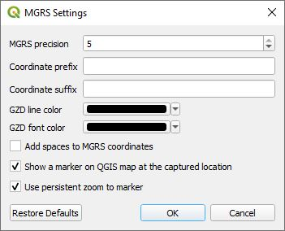

# MGRS Plugin

***MGRS*** provides zoom to and coordinate capture ability for MGRS coordinates separate from the ***Lat Lon Tools*** plugin. It was produced for users who want separate tools and to be able to have both ***MGRS*** and ***Lat Lon Tools*** windows displayed at the same time. If you need the ability to convert an attribute table with MGRS coordinates to a new point layer or convert a point layer to a new layer with an MGRS attribute string, then use ***Lat Lon Tools***. These are the MGRS tools as shown on the ***MGRS toolbar***. 

*  ***Copy/Display MGRS Coordinate*** - This captures MGRS coordinates onto the clipboard when the user clicks on the map. If snapping is enabled under QGIS ***Project->Snapping Options...*** menu, then *Copy/Display MGRS Coordinate* will snap to any close vector vertices according to the parameters set in the snapping options.
  
*  ***Zoom to MGRS Coordinate*** - With this tool, type or paste an MGRS coordinate into the text area and press **Enter**. QGIS centers the map on the coordinate, highlights the location and creates a temporary marker at the location. The marker can be removed with the  button. The following shows the dockable zoom to dialog box.

    

    

## Settings

These are the available settings that are available from the QGIS menu ***Plugins->MGRS->Settings***

* ***MGRS precision*** - This determs the precision of the captured MGRS coordinate. It ranges from 0 to 5 with 5 being the highest resolution.
* ***Coordinate prefix*** - This text string is added to the beginning of the captured MGRS coordinate.
* ***Coordinate suffix*** - This text string is added to the end of the captured cMGRS oordinate.
* ***Use persistent zoom to marker*** - If this is checked, then when you zoom to an MGRS coordinate a persistent marker is displayed until you exit, zoom to another location, or click on the  button.
* ***Show marker on QGIS map at the captured location*** - If checked, a temporary marker will be displayed at the location clicked on with the ***Copy/Display MGRS Coordinate*** tool.
