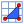
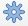
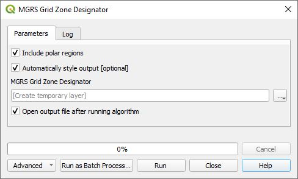
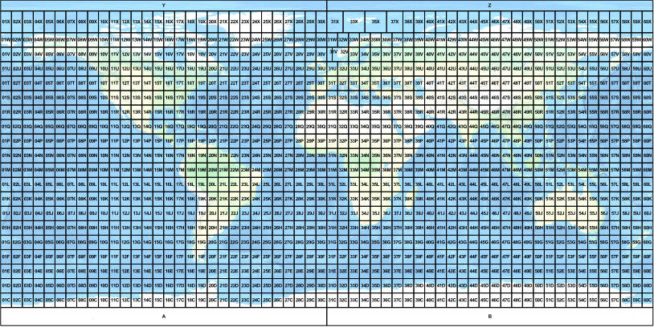

# MGRS Plugin

***MGRS*** provides zoom to and coordinate capture ability for MGRS coordinates separate from the ***Lat Lon Tools*** plugin. It was produced for users who want separate tools and to be able to have both ***MGRS*** and ***Lat Lon Tools*** windows displayed at the same time. Given a set of MGRS coordinates, the ***MGRS Geometry Generator*** tool displays the coordinates as points, line, polygon, or a bounding box around them. It also provides an algorithm to create an MGRS Grid Zone Designator layer. If you need the ability to convert an attribute table with MGRS coordinates to a new point layer or convert a point layer to a new layer with an MGRS attribute string, then use ***Lat Lon Tools***. The MGRS plugin is installed in the QGIS Plugins menu.

These are the MGRS tools as shown on the ***MGRS toolbar***. 

*  ***Copy/Display MGRS Coordinate*** - This captures MGRS coordinates onto the clipboard when the user clicks on the map. If snapping is enabled under QGIS ***Project->Snapping Options...*** menu, then *Copy/Display MGRS Coordinate* will snap to any close vector vertices according to the parameters set in the snapping options.
  
*  ***Zoom to MGRS Coordinate*** - With this tool, type or paste an MGRS coordinate into the text area and press **Enter**. QGIS centers the map on the coordinate, highlights the location and creates a temporary marker at the location. The marker can be removed with the  button. The following shows the dockable zoom to dialog box.

    

*  ***MGRS Geometry Generator*** - This provides a text box to paste in MGRS coordinates. The user has the options to display these as points, a line, a polygon, or a bounding box that encloses all the points. Here is the dialog box. The choices for the drop down menu next to ***Render as...*** are ***Points***, ***Line***, ***Polygon***, and ***Bounding Box***. The ***MGRS Points*** layer attributes include the input MGRS coordinate as well as longitude and latitude. The ***MGRS Line*** layer attributes include the geodesic distance in meters of the line. The ***MGRS Polygon*** layer attributes include the geodesic perimeter in meters, its area in meters^2 and whether the polygon has a valid geometry or not. The parameters for the ***MGRS Bounding Box*** includes the minimum and maximum latitude and longitudes, the geodesic perimeter in meters and the geodesic area in meters^2.

    

*  ***MGRS Grid Zone Designator*** - This will create an MGRS Grid Zone Designator overlay layer.

    

    
    * ***Include polar regions*** - If checked the polar grid zones A,B and Y,Z are included in the output.
    * ***Automatically style output*** - If checked, the output layer will automatically be styled with colors from the **Settings** menu.
    
    The output layer can be saved and reused without needing to run this processing algorithm again. This is an example of the output of the algorithm.
    
    

## Settings

These are the settings that are available from the QGIS menu ***Plugins->MGRS->Settings***

* ***MGRS precision*** - This determines the precision of the captured MGRS coordinate. It ranges from 0 to 5 with 5 being the highest resolution.
* ***Coordinate prefix*** - This text string is added to the beginning of the captured MGRS coordinate.
* ***Coordinate suffix*** - This text string is added to the end of the captured MGRS coordinate.
* ***GZD line color*** - This is the outline color used when the MGRS Grid Zone Designator algorithm is executed.
* ***GZD font color*** - This is the font color used for the grid zone labels when the MGRS Grid Zone Designator algorithm is executed.
* ***Add spaces to MGRS coordinates*** - This will add spaces to an MGRS coordinate when checked. Unchecked it looks like "16TDL8016526461" and checked it looks like "16T DL 80165 26461".
* ***Use persistent zoom to marker*** - If this is checked, then when you zoom to an MGRS coordinate a persistent marker is displayed until you exit, zoom to another location, or click on the  button.
* ***Show marker on QGIS map at the captured location*** - If checked, a temporary marker will be displayed at the location clicked on with the ***Copy/Display MGRS Coordinate*** tool.
